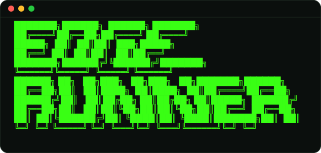

A web app for an agent harness. Run local models through agent harnesses on
remote GPUs (llama.cpp on Kaggle), driven from a terminal-themed chat UI.

```
   ___    _           ___
  / _ \  | |__       / _ \
 | | | | | '_ \     | | | |   EDGE
 | |_| | | | | |    | |_| |   RUNNER
  \___/  |_| |_|     \___/
```

## Architecture

```
┌──────────────┐      SSE / HTTP      ┌──────────────────┐      ┌───────────────┐
│  Frontend    │  ───────────────▶    │  FastAPI server  │ ───▶ │  Harness      │
│  (Next.js)   │  ◀───────────────    │  (tunnelled url) │ ◀─── │  + llama.cpp  │
│  terminal UI │      token stream    │                  │      │  (Kaggle GPU) │
└──────────────┘                      └──────────────────┘      └───────────────┘
```

- **backend/** — FastAPI. Exposes a catalog of models + harnesses and a
  streaming chat endpoint. Designed to run on Kaggle and be reached via a
  tunnelled URL. Ships with two harnesses:
  - `echo` — a mock that streams a canned reply, so the whole loop runs
    locally with no GPU.
  - `llamacpp` — the live harness; streams from a llama.cpp `llama-server`
    (OpenAI-compatible API) over `LLAMACPP_BASE_URL`.
- **deploy/** — Kaggle bootstrap: build llama-server, download a GGUF, serve
  it, run the backend, and open a Cloudflare tunnel. See
  [deploy/README.md](deploy/README.md).
- **frontend/** — Next.js (App Router) + TypeScript + Tailwind. Open WebUI-style
  clone with an ASCII-art logo, terminal aesthetic, model picker, and harness
  picker.

## Quick start

Backend:

```bash
cd backend
python -m venv .venv && source .venv/bin/activate
pip install -e .
uvicorn app.main:app --reload --port 8000
```

Frontend:

```bash
cd frontend
npm install
npm run dev
```

Then open http://localhost:3000. The frontend talks to the backend at
`NEXT_PUBLIC_API_URL` (defaults to `http://localhost:8000`).
