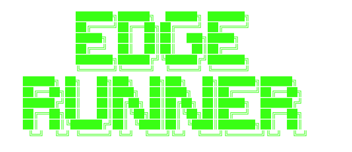

<p align="center">
  
</p>

<p align="center">
  <strong>An autonomous agent harness & high-throughput neural runtime for edge nodes and remote GPUs.</strong>
</p>

<p align="center">
  
  
  
  
  
  
</p>

---

## ⚡ Overview

**EdgeRunner** is a terminal-aesthetic web workspace and autonomous agent runtime designed to run frontier LLMs (GGUF quantizations) on remote GPU nodes (e.g., Kaggle T4/P100 instances, local `llama-server` rigs) with DeepSeek AI's official Harness (`dsh`) engine.

Powered by the **Cordis meta-framework**, EdgeRunner unifies dual-phase `<think>` reasoning, dynamic contextual bandit tool slicing, verbal reinforcement episodic memory, and a secure local-first execution sandbox.

```
┌─────────────────────────────────────────────────────────────┐
│                   EdgeRunner Agent Engine                   │
│         Powered by DeepSeek Harness (Cordis Kernel)         │
├──────────────────────────────┬──────────────────────────────┤
│  Runtime Presets             │  Cordis Plugin Pipeline      │
│  - Code (Surgical SE)        │  - dsh-plugin-reasoning      │
│  - Standard (Autonomous ReAct│  - dsh-plugin-sandbox        │
│  - Minimal (Low Latency)     │  - dsh-plugin-linucb-router  │
│  - Creator (Scaffolding/App) │  - dsh-plugin-reflexion      │
│                              │  - dsh-plugin-session-fork   │
└──────────────────────────────┴──────────────────────────────┘
                               │
               Dispatches Sandboxed Actions
                               ▼
┌─────────────────────────────────────────────────────────────┐
│                 EdgeRunner Execution Sandbox                │
│  - Backend: Isolated Workspace Subprocess with CWD Memory   │
│  - Frontend: In-Browser WebAssembly PTY (Local to Device)   │
│  - Strict Workspace Confinement & Fuzzy Path Auto-Resolver  │
└─────────────────────────────────────────────────────────────┘
```

---

## 🚀 Key Features

### 1. Unified DeepSeek Harness (`dsh`) Core
- **Dual-Phase `<think>` Reasoning Streaming**: Real-time token parsing routes chain-of-thought traces into an interactive, collapsible dropdown with live elapsed duration metrics (`thought for 1.2s`).
- **Cordis Meta-Framework**: Plugin-first architecture with lifecycle hooks (`before_step`, `on_reasoning_chunk`, `on_tool_call`, `after_tool_exec`, `on_fork`).
- **4 Runtime Presets**:
  - **`Code`** *(Default)*: Line-window inspection (`view_file`), surgical search-and-replace (`replace_file_content`), compiler checks, test runners.
  - **`Standard`**: Multi-turn planning, web search, bash execution, programmatic ML oracles.
  - **`Minimal`**: Zero-overhead high-throughput direct answers without tool intervention.
  - **`Creator`**: Full-stack scaffolding, Next.js / Tailwind UI development, and live preview rendering.
- **Contextual LinUCB Bandit Router**: Online ridge regression over $\mathbb{R}^6$ context features dynamically slices only the active tools needed for the turn, keeping prompt context lightweight.
- **Reflexion Episodic Memory**: Persisted counterfactual memory buffer (`.edgerunner_reflexion.db`) preventing repeated environment or syntax errors.
- **Time-Travel Session Branching (`⑂ fork`)**: Non-destructive DAG branching allowing you to fork off any past assistant checkpoint into an independent conversation tree.
- **Semantic Session Auto-Naming**: Automatically cleans conversational noise and generates clean, entity-first session titles.
- **Multi-Turn KV Cache Alignment**: Enforces fixed system prompts and uniform message structures to guarantee $>90\%$ KV cache hit rates on remote GPU backends.

### 2. Four Integrated Modes
1. **`[ 01 ] /chat`** — Direct neural completion and conversational inference.
2. **`[ 02 ] /agent`** — Autonomous DeepSeek Harness with dual-phase reasoning and tool execution.
3. **`[ 03 ] /terminal`** — Interactive WebAssembly PTY terminal with virtual filesystem.
4. **`[ 04 ] /workspace`** — Full-featured Monaco editor, file tree explorer, and Git DAG visualization.

### 3. Local-First & Sandboxed Execution
- **Strict Sandbox Confinement**: The agent is strictly locked inside the designated `./workspace` root. Path traversal (`../`) and external filesystem access are blocked.
- **Persistent CWD Tracking**: Directory changes (`cd subdir`) persist across consecutive turns.
- **Recursive Syntax Sanitization**: Multi-layer sanitizer unwraps malformed JSON/XML tool calls from smaller models without syntax error loops.

---

## ⌨️ Keyboard Shortcuts

| Key Combo | Action | Description |
| :--- | :--- | :--- |
| **`⌘K` / `Ctrl+K`** | **Home / Reset** | Closes workspace and returns to the Hero Landing Page |
| **`⌘⇧N` / `Ctrl+Shift+N`** | **New Session** | Creates a new session |
| **`⌘B` / `Ctrl+B`** | **Sessions History** | Toggles the slide-out history drawer |
| **`⌘M` / `Ctrl+M`** | **Model Matrix** | Opens the Neural Payload Matrix and weight switcher |
| **`⌘\` / `Ctrl+\`** | **Dock / Expand** | Cycles between docking all windows and focusing active |
| **`Tab` / `Shift+Tab`** | **Cycle Windows** | Cycles active focus forward / backward across sessions |
| **`⌘,` / `Ctrl+,`** | **Settings** | Toggles Kaggle compute rig and backend configuration panel |
| **`⌘L` / `Ctrl+L`** | **Clear Transcript** | Clears message history for the currently active session |
| **`Escape`** | **Dismiss / Abort** | Closes active modals/drawers and aborts streaming |
| **`⌘/`** or **`?`** | **Shortcuts HUD** | Displays the interactive keyboard cheatsheet |

---

## 🛠️ Quick Start

### 1. Backend Setup

```bash
cd backend
python -m venv .venv
source .venv/bin/activate
pip install -e .

# Run the FastAPI server
uvicorn app.main:app --reload --port 8000
```

Run test suite (64/64 passing):
```bash
pytest
```

### 2. Frontend Setup

```bash
cd frontend
npm install

# Start Next.js dev server
npm run dev
```

Open [http://localhost:3000](http://localhost:3000) in your browser. The frontend automatically connects to `http://localhost:8000` (or your remote Kaggle tunnel URL).

### 3. Remote GPU Deployment (Kaggle)
1. Open a Kaggle Notebook with GPU acceleration (T4 or P100).
2. Use the deployment script in `kaggle/` or the in-app **⚙ Settings Panel** to launch the automated worker script with Cloudflare tunneling.
3. Paste the tunnel URL into EdgeRunner to stream tokens directly from your Kaggle GPU instance.

---

## 📁 Repository Structure

```
EdgeRunner/
├── backend/
│   ├── app/
│   │   ├── harnesses/          # Agent (dsh), Chat, Terminal, and Echo harnesses
│   │   ├── dsh_plugins.py      # Cordis kernel, plugins (Reasoning, LinUCB, Reflexion, Fork)
│   │   ├── tools.py            # Sandboxed Unix terminal, view_file, replace_file_content
│   │   ├── routers/            # FastAPI routes (chat, catalog, models, session, files)
│   │   └── main.py             # FastAPI entrypoint
│   └── tests/                  # Pytest test suite (64 tests passing)
├── frontend/
│   ├── app/                    # Next.js App Router (layout, landing, workspace)
│   ├── components/             # Composer, Message, Markdown, Terminal, Modals, Logo
│   ├── lib/                    # deepseekHarness, dshPlugins, api, storage, useConversations
│   └── public/
│       └── EdgeRunner.svg      # Authentic ASCII vector wordmark
└── kaggle/                     # Automated remote Kaggle GPU bootstrap scripts
```

---

## 📜 License

MIT License. Designed and crafted for high-performance edge inference.
